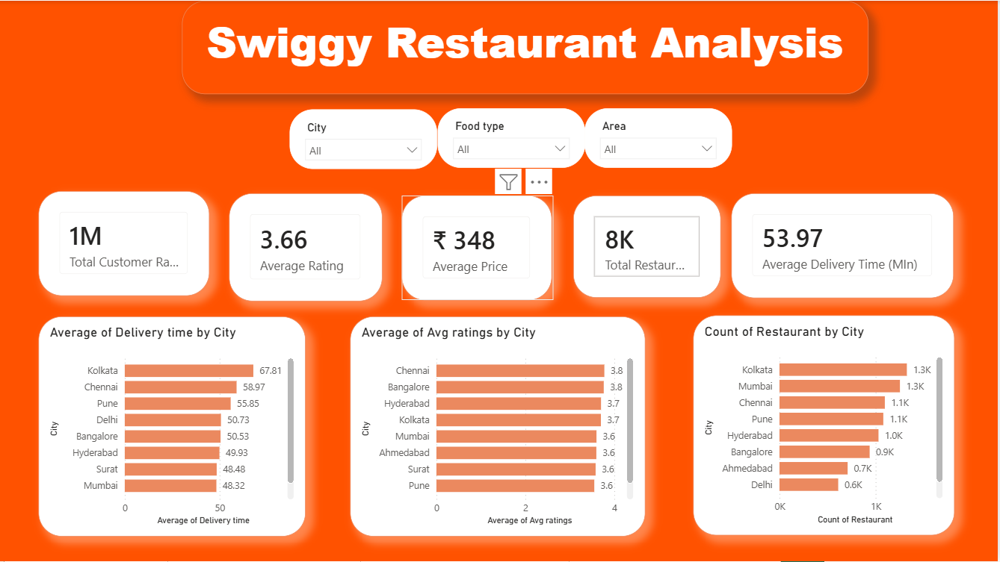
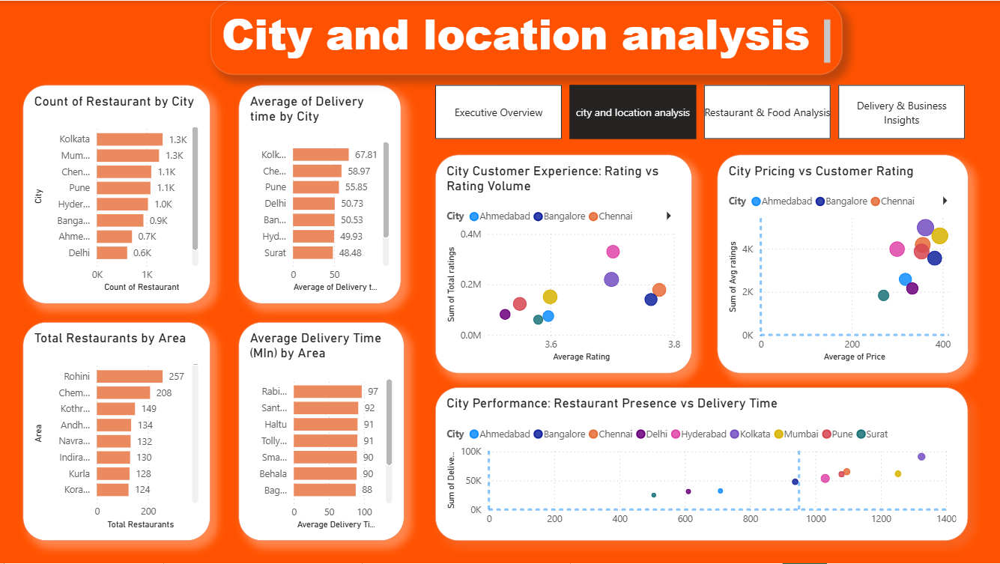
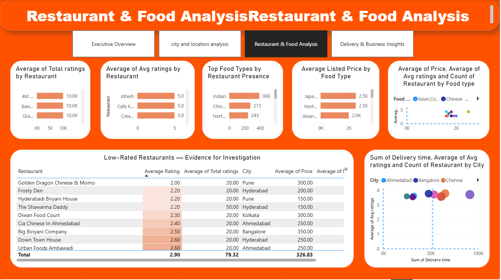
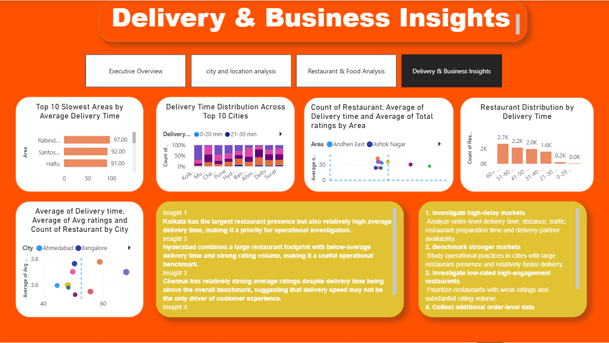

# Swiggy Restaurant & Delivery Performance Analysis

A business analytics portfolio project using **Microsoft Excel and Power BI** to explore restaurant presence, pricing, customer ratings, food categories, and delivery performance across locations.

## 📊 Project Overview

The goal of this project is to turn restaurant and delivery data into clear business insights that can support operational and market-level decision making.

### Business Questions

- Which cities and areas have the largest restaurant presence?
- Which locations have relatively higher delivery times?
- How do customer ratings vary across cities and restaurants?
- How does listed price vary by city and food category?
- Which restaurants have high rating volume or lower ratings that may warrant investigation?
- Which areas could be prioritized for operational review?

## 🛠️ Tools & Skills

- **Microsoft Excel** — data cleaning, formulas, PivotTables, KPI analysis
- **Power BI** — data modeling, DAX, interactive dashboards and visualization
- **Business Analysis** — descriptive analysis, pattern identification and recommendations

## 📁 Dataset

The project uses a Swiggy restaurant dataset containing restaurant, location, pricing, rating and delivery-time information.

Key fields include:

- ID
- Area
- City
- Restaurant
- Price
- Average Rating
- Total Ratings
- Food Type
- Address
- Delivery Time

## 🔄 Analysis Workflow

**Raw Data → Data Quality Checks → Data Preparation → Excel/PivotTable Analysis → Power BI Dashboard → Business Insights → Recommendations**

## 📸 Dashboard Preview

### Dashboard Overview

### City Analysis

### Restaurant Analysis

### KPI Summary

## 📈 Key Metrics

The project focuses on consistently defined metrics including:

- Restaurant records
- Unique restaurants
- Number of cities and areas
- Average rating
- Average listed price
- Average delivery time
- Total rating volume

> **Metric note:** Average listed price represents the price field available in the dataset. It should not be interpreted as average order value or revenue because the dataset does not contain transaction-level sales data.

## 💡 Business Analysis Approach

The analysis focuses on descriptive and diagnostic questions rather than claiming causation. Relationships between price, ratings, restaurant presence and delivery time are treated as patterns requiring further investigation rather than proof that one factor directly causes another.

## 📂 Project Files

| File | Purpose |
|---|---|
| `swiggy_data.xlsx` | Source dataset and Excel analysis |
| `swiggy project powerbi.pbix` | Power BI report |
| `images/` | Dashboard preview screenshots |

## ⚠️ Limitations

- The dataset is observational and does not contain order-level revenue, profit, customer-level or transaction-level information.
- Listed price should not be treated as actual customer spend.
- Relationships observed in the dashboard do not establish causation.
- Some analytical categories are defined for this project and may not represent official Swiggy classifications.

## 👤 Author

**Alvin Atelier**  
Business Analytics / Business Analyst Portfolio Project
